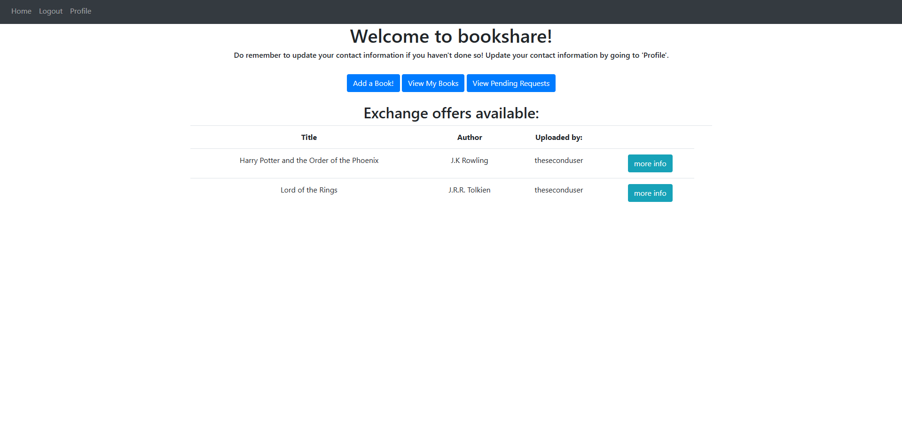
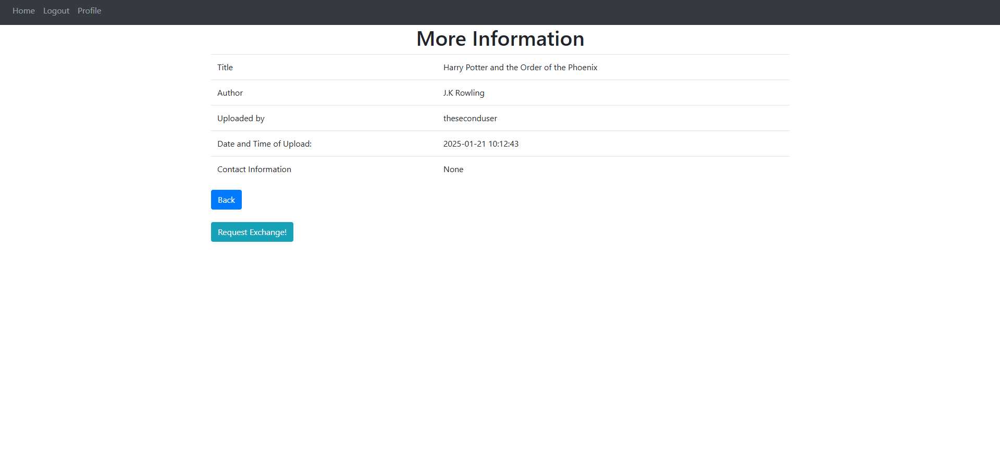
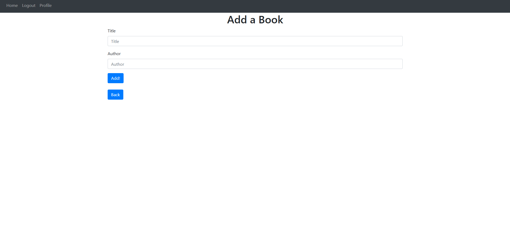
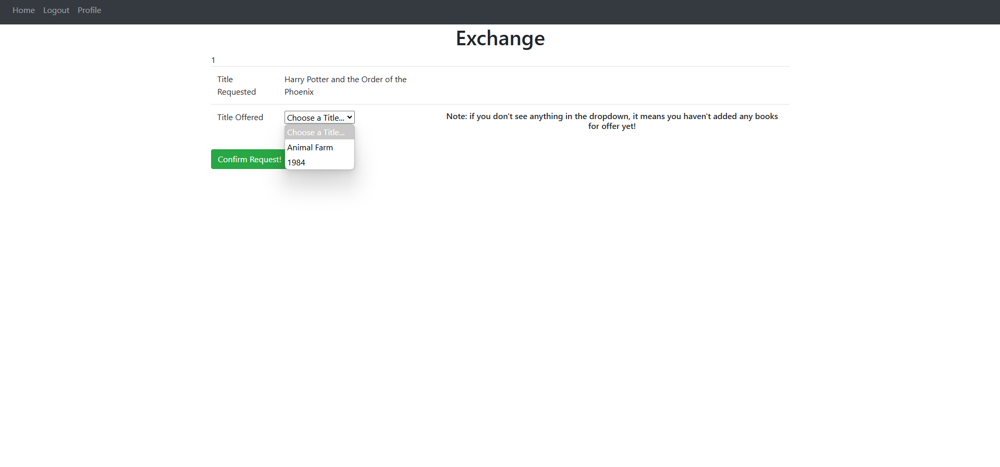
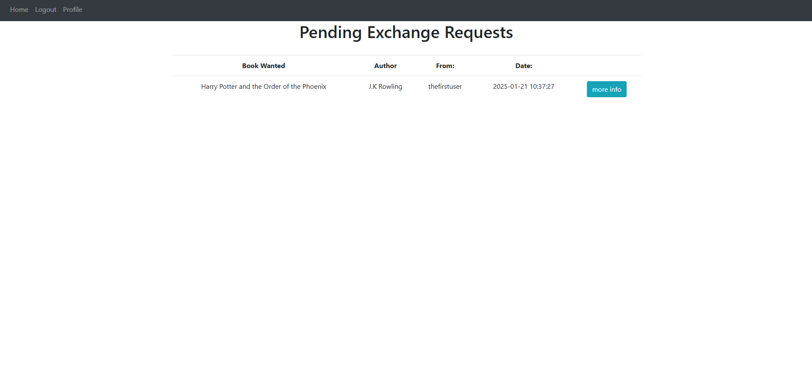
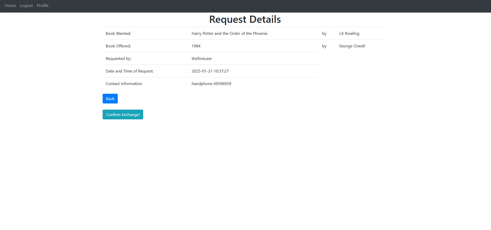

 Bookshare is a flask web-application designed to help book enthusiasts find like-minded people to exchange books with. In so doing, Bookshare allows old books to gain a new life in a different reader's hands.

<h2>Getting Started</h2>
This version of bookshare relies on a couple of dependencies that one will need to install:

- flask 
- flask_login
- sqlalchemy

Here are the steps to set up the dependencies
1. Open a terminal and navigate to the folder which your copy of the project is housed in.
2. Install flask by running `pip install flask` in the terminal.
3. Install flask_login by running `pip install flask_login` in the terminal.
4. Install sqlalchemy by running `pip install sqlalchemy` in the ternimal.

<h2>Key Features</h2>
Bookshare supports a host of basic features to help users list their books for exchange and partake in the exchange of books. It also comes with authentication features and simple profile management.

<h3>Authentication</h3>
Bookshare simply requires an user to have a username and a password to sign in to their account. If the user is a first-timer, they can opt to sign up by clicking the "Sign Up" button on the top of the page.

<h3>Home Page</h3>

The Homepage is the main page where one is able to see the books that are available for exchange, as well as access many other useful pages. 

If one wishes to find out more about a book put up for exchange, one can click on the "more info" button on the side of the listing. This will bring one to another page containing more information about the listing:

If one is interested to make an exchange they can click on the "Request Exchange!" button to proceed to make an exchange request. More on exchange requests will be covered later.

<h3>Add a book</h3>

To add a book, one simply needs to click on the "Add a Book!" button, which is found on the homepage and myoffers page. This will bring one to a page that lets them fill in the details of the book such as `title` and `author`, and subsequently add the book.

Once the book is added, it will be visible to other accounts, on their homepage.

<h3>Requesting Exchanges</h3>

Once a user clicks on the "Request Exchange!" button, they will be redirected to the page for requesting an exchange. Here, they **must** select one book with which to exchange for the other book. Once "Confirm Exchange!" is clicked, a request will be sent to the account who posted the exchange.

<h3>Pending Requests</h3>

This page will show a user all their pending requests. It can be accessed from the homepage, by clicking the "View Pending Requests" button. Similar to the homepage, one can see more details of the exchange by clicking on the "more info" button found on the side of each request:

<h3>Confirming Exchanges</h3>
Once the exchange has been  made offline, one can click on the "Confirm Exchange!" button to update their record and close the request. Since this is an irreversible action, one will be asked to confirm their action before proceeding.
  

> **A little note about the backend operation behind "Confirm Exchange":**  
>
> Upon confirming the exchange, both books involve in the exchange will be **permanantly deleted** from **both** the `offers` table and the `requests` table. 
>
>For `requests`, this means that even if the book, at the point of confirmation, is being offered in another pending request, that request **will be deleted as well.** In other words, no matter if the book is the wanted book or the offered book, any `request` involving the book will be deleted.

<h3>Technologies</h3>

- Frontend: HTML
- Backend: Flask, Python
- Storage: SQLite3

Flask and Python were chosen for the backend due to the nature of limited time provided for this project. Furthermore, Python was relatively easier to code in. Therefore, using Flask and Python allowed for rapid development of the application and its features.

SQLite3 was chosen as the choice of storage as it was a lightweight database that was more than capable of handling the project's needs at this stage.

<h3>Limitation and Future Developments</h3>
As of this version, there are many things to be improved.

For instance, the deletion of `requests` could be handled better instead of destructively deleting every single known record of the books involved in the exchange. Perhaps there could have been notifications informing the user that certain pending `requests` have been cancelled due to the deletion of the books involved. Another way to handle this would be to make a `Completed Exchanges` feature and store the completed exchanges somewhere, while similarly notifying users that some pending `requests` are now invalid.

Moreover, there are many aspects of the front-end which could be improved too. There could be a feature to let users take pictures of their books and upload it to the site in the future. There could also be a feature to allow users to specify the state of their book, whether it is brand-new, lightly-used, or heavily-used. However, due to the time constraint given, these features were not considered for the minimum viable product.

Once again, these are just some of the many improvements that are possible at this stage of development.

<h3>Credits</h3>
I would like to give special credit to "Tech with Tim", whose youtube tutorial ["Python Website Full Tutorial - Flask, Authentication, Databases & More"](https://www.youtube.com/watch?v=dam0GPOAvVI) offered me invaluable guidance in the development of the application. I will also include the [github link](https://github.com/techwithtim/Flask-Web-App-Tutorial/tree/main) to his repository, which my code is heavily based on.

